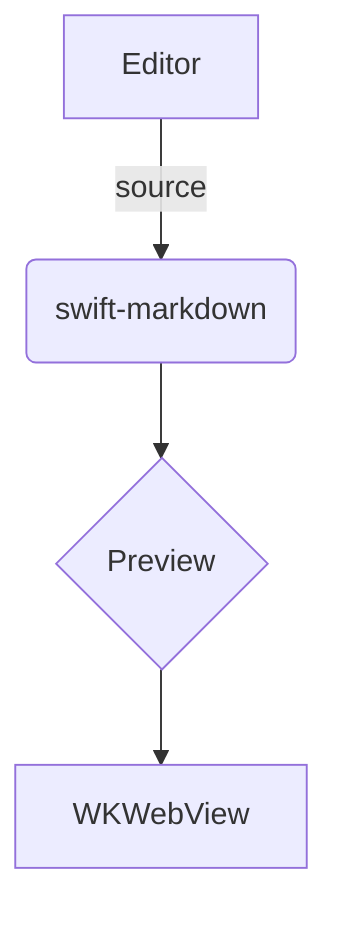

# GFM kitchen sink

A paragraph with **bold**, *italic*, ~~strikethrough~~, `inline code`, and a
[link](https://example.com). Here is a footnote reference.[^1]

## Table

| Feature      | Editor | Preview |
| ------------ | :----: | ------: |
| Tables       |   ✓    |       ✓ |
| Task lists   |   ✓    |       ✓ |
| Strikethrough|   ✓    |       ✓ |

## Task list

- [ ] Unchecked item
- [x] Checked item
  - [ ] Nested unchecked

## Ordered list

1. First
2. Second
3. Third

## Code block

```swift
func greet(_ name: String) -> String {
    return "Hello, \(name)!"
}
```

## Math

Inline math $E = mc^2$ and a display block:

$$
\int_{0}^{\infty} e^{-x^2}\,dx = \frac{\sqrt{\pi}}{2}
$$

## Mermaid



## Blockquote

> The source string is the single source of truth.
> The AST is a derived value.

[^1]: This is the footnote text.
